

  # 🚀 Finance Management System

  *A sleek, full-stack application to elegantly track income, manage expenses, and visualize your financial health.*

  
  
  
  
  

---

## ✨ Features
- 🔐 **Secure User Authentication:** Register and log in safely.
- 💸 **Transaction Tracking:** Effortlessly Add, Edit, and Delete daily income and expenses.
- 📊 **Dynamic Dashboard:** Get an instant visual overview of your financial standing.
- 📁 **Data Export:** Export your transaction history directly to CSV format.
- 👤 **Profile Management:** Keep your user profile details up-to-date.

## 📸 Screenshots

Here is a look at the system in action:

| Dashboard | Transactions |
| :---: | :---: |
| 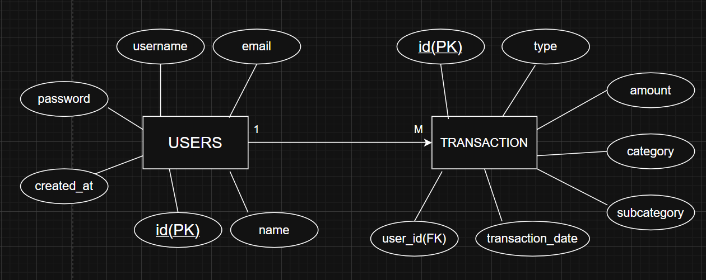 | 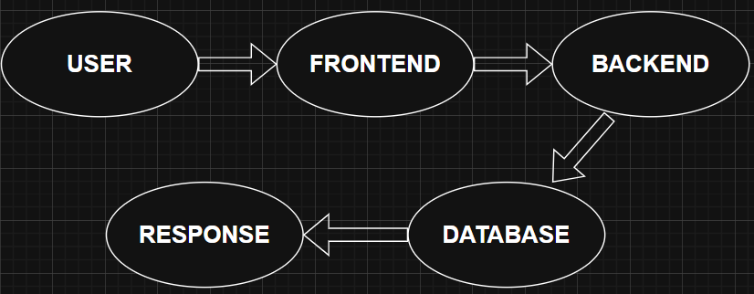 |

| Reports | Profile |
| :---: | :---: |
| 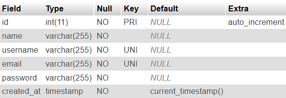 | 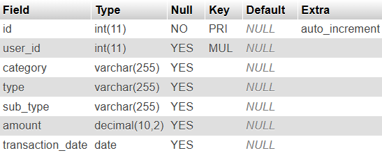 |

<b>Click here to view more screenshots</b>

| View 5 | View 6 |
| :---: | :---: |
| 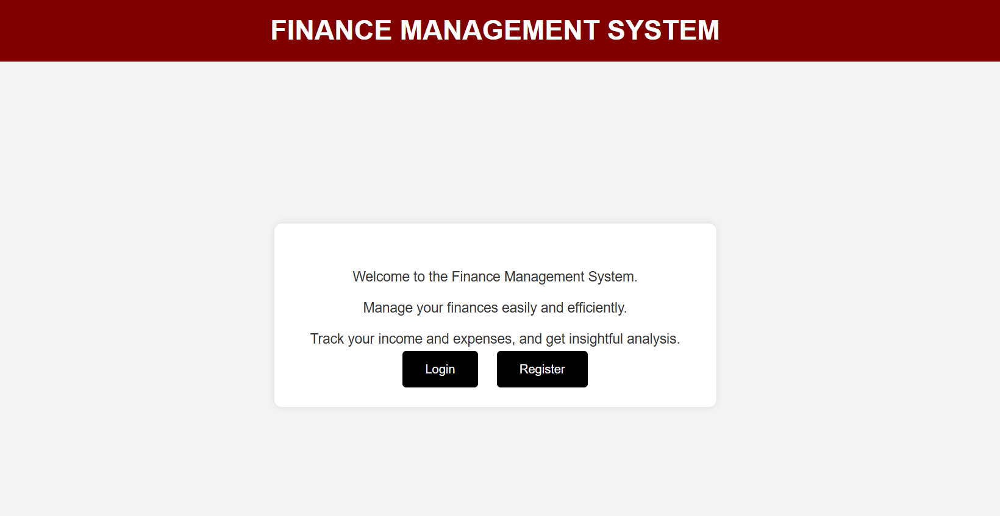 | 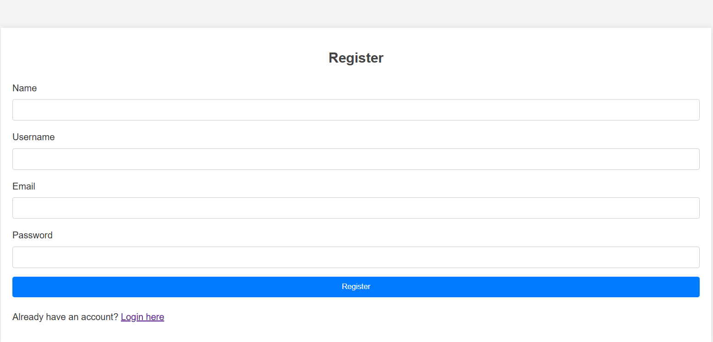 |

| View 7 | View 8 |
| :---: | :---: |
| 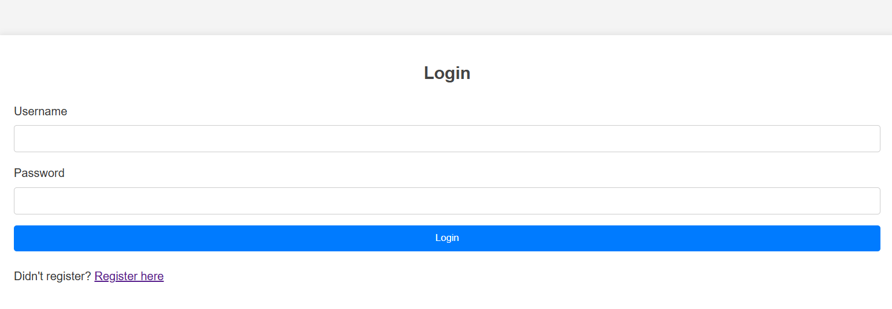 | 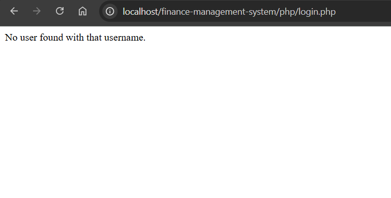 |

| View 9 | View 10 |
| :---: | :---: |
| 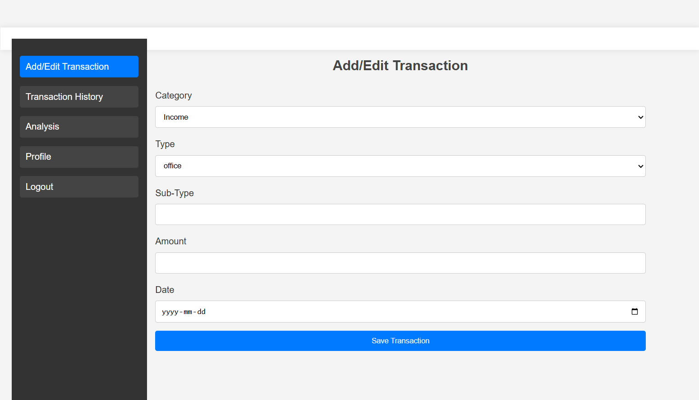 | 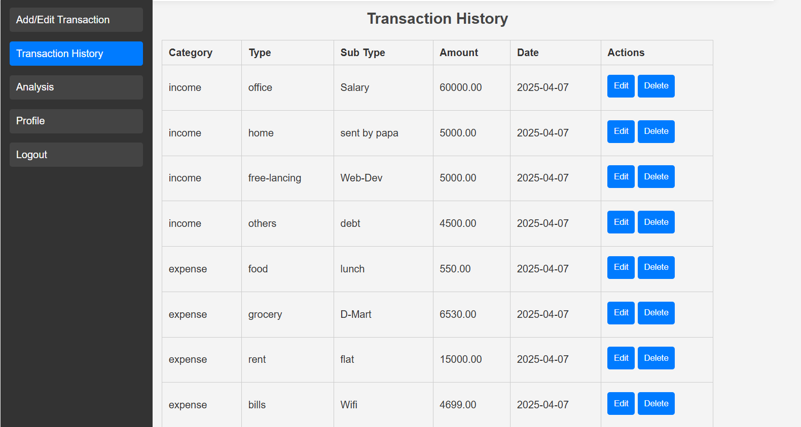 |

| View 11 | View 12 |
| :---: | :---: |
| 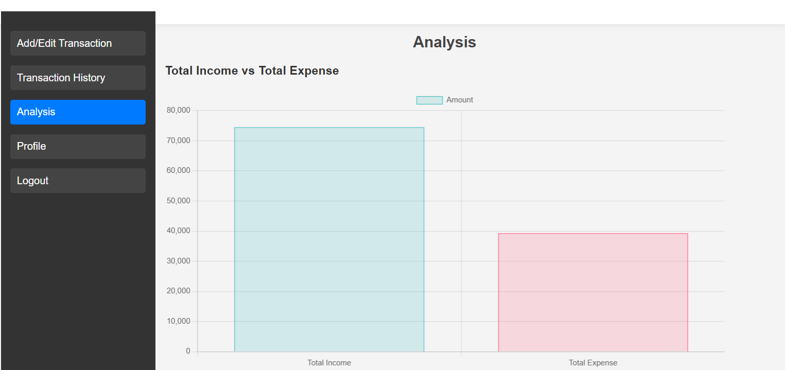 | 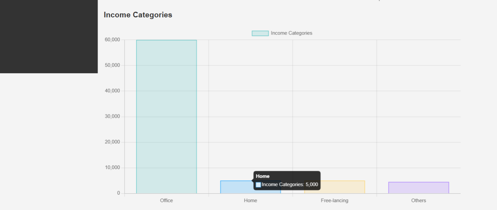 |

| View 13 | View 14 |
| :---: | :---: |
| 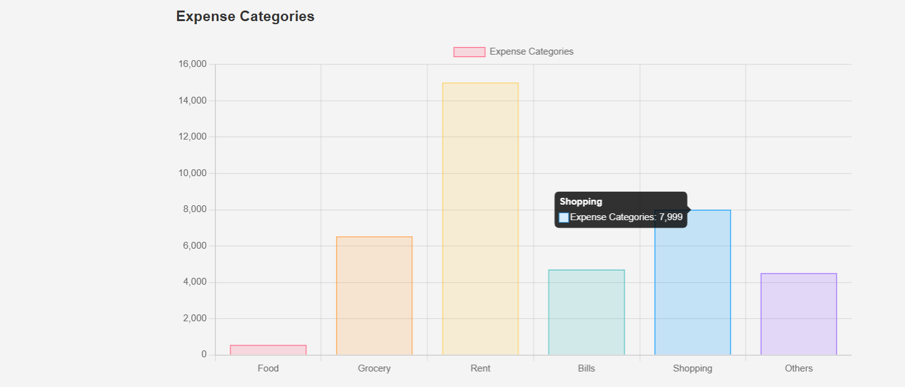 | 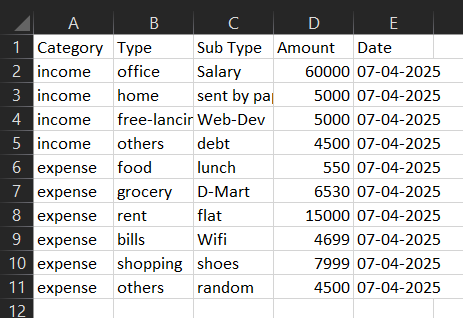 |

## 🛠️ Tech Stack & Architecture
- **Frontend**: Responsive HTML5, CSS3, and Vanilla JavaScript.
- **Backend**: Core PHP handling server-side logic.
- **Database**: MySQL via the `mysqli` object-oriented approach.

## ⚙️ Local Setup Instructions
1. Clone this repository: `git clone https://github.com/ritesh-0608/FINANCE-MANAGEMENTSYSTEM.git`
2. Move the project folder into your local server's root directory (e.g., `C:\xampp\htdocs\`).
3. Start **Apache** and **MySQL** via your XAMPP Control Panel.
4. Create a MySQL database named `finance_management`.
5. Ensure `php/db.php` has your correct database credentials.
6. Open your browser and navigate to `http://localhost/finance-management-system`.

<!-- minor format update -->
